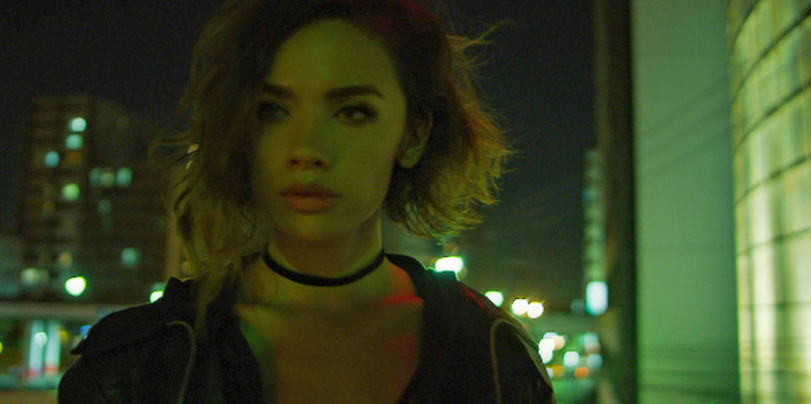
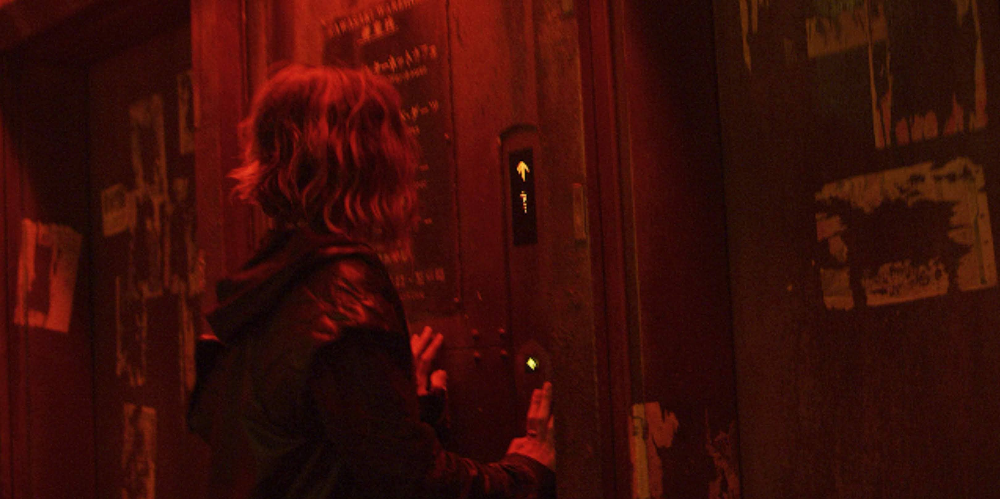

I get my inspiration from many of my shoots from character designs and art-styles from the video games, manga, and anime that influenced me growing up.

[row][col][/col][col][/col][/row]

[row][col][/col][/row]

[row][col][/col][col][/col][/row]

[row][col][/col][/row]

[row][col][/col][col][/col][/row]

[row][col][/col][/row]

[row][col][/col][/row]

[row][col][/col][/row]

[row][col][/col][/row]

[row][col][/col][col][/col][/row]

[row][col][/col][/row]

[row][col][/col][/row]
[row][col][/col][col][/col][/row]
[row][col][/col][/row]

[row][col][/col][col][/col][/row]

[row][col][/col][/row]

[row][col][/col][col][/col][/row]

[row][col][/col][col][/col][col][/col][/row]

[row][col][/col][col][/col][/row]

[row][col][/col][col][/col][/row]

[row][col][/col][/row]
[row][col][/col][/row]

[row][col][/col][col][/col][/row]

[row][col][/col][col][/col][/row]

[row][col][/col][/row]

[row][col][/col][/row]
